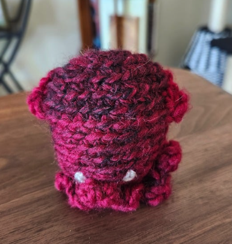

Twice this fall, I shared something I have been dreaming about and working on personally. I’ve struggled to recapture curiosity lately, but that doesn’t mean it’s gone!

I took an ambiguous career path ([read more about that here](/blog/the-power-of-career-change)). For the first time a few years ago, I followed my personal curiosity, which morphed into my tech career! I’ve been rebuilding my “curiosity muscles” using tactics identified through my own research that can be practiced over time.

Let’s be clear: I am not an expert on curiosity or perfect at practicing it. However, I am genuinely interested in building up and practicing curiosity. I've been seeking this type of “exercise” for a long while, and I am currently practicing my own techniques. I am SO happy to share them with you, too!

**Here, we’ll cover:**

1. 🎬 Video + Presentation Insights
2. 🤔 What is Curiosity?
3. ⚖️ Benefits + Challenges
4. 👉 The 4 Core Concepts

## 🎬 video + presentation insights

Below is a recording of the first presentation for “Capturing Curiosity”, a collaboration with Coding with Callie in September 2024. It was a blast to finally share this content! The actual presentation is about 40 minutes long, followed by a Q&A.

If you have any feedback you would like to share, I’m open to hearing it! [Link to the current slides, if interested!](https://www.canva.com/design/DAGRKyHC3TE/FUsGdL0j9XI1Ck96kVq2eQ/edit?utm_content=DAGRKyHC3TE&utm_campaign=designshare&utm_medium=link2&utm_source=sharebutton)

  <iframe
    src="https://www.youtube-nocookie.com/embed/QX8qPM_xKBE"
    title="capturing curiosity talk recording"
    loading="lazy"
    allow="accelerometer; autoplay; clipboard-write; encrypted-media; gyroscope; picture-in-picture; web-share"
    allowfullscreen
    style="position:absolute;inset:0;width:100%;height:100%;border:0"
  ></iframe>

**Lessons learned in the first presentation:**

- Consider the timing for outside lighting. 😅 I didn’t realize until halfway through that I was partially in shadow. I don’t usually record that time of evening!
- The Q&A highlighted a few lacking areas of my initial introduction story, so I added more detail for later iterations. ✅

A few weeks later, I shared only my intro in another online setting, my Toastmasters group, where I’m excited to learn and grow into a more professional presenter. Though it was a brief glimpse into the talk, I received helpful feedback on my physical and verbal presentation techniques rather than the content.

About a month after the first full talk, I shared this again at the [PLoP 2024](https://plopcon.org/plop2024/) conference, focusing on “Pattern Languages of Programs, People & Practices.” Applying curiosity fits each of these because you need to consider how you will interact with people, how you can apply your curiosity to software - or other tangible things - that you build, and how you approach practices in your day-to-day, personally and professionally.

This third event was also live but not recorded. In this space, we focused more on the patterns and a pattern language concept as it applied to curiosity.

**I received advice about the structure of the content along with other learnings:**

- The previous group ended late, so we started late. I cut a fair bit of the original talk in real time. It would benefit me to identify before a talk where I could best cut to still provide a great experience to the audience.
- Questions or discussions happen unexpectedly in a more collaborative, in-person, and live environment! More than once, my audience interrupted me with excellent insights, suggestions, and questions. This was valuable to all! Again, identifying options to cut in advance would have helped me cultivate this live experience without losing too much of the core.
- There was confusion in **Ask the “Right” Questions** that could have been more clearly outlined. Using the “anti-pattern” term would help better identify the negative behaviors. (I have not made this change, but will use this for a later iteration!)
- Upon reflection, some of the examples I use feel immature. My audiences are intelligent adults. I want to add stronger examples to practice with. I cut a robust set of examples in the first and second iterations because I was limited on time, but if this is ever used for another collaborative or workshop-style presentation, I’d love better options!

I learned so much through these experiences! I appreciate everyone who spoke up to ask questions and who provided me feedback individually, including friends, family, and LinkedIn connections who watched the recording afterward. 🙏

## 🤔 what is curiosity?

Selfishly, I research curiosity to better understand it and continue to learn and grow as a human being. I’ve worked to reprogram my brain and retrain my actions to lean into my own curiosity. I’ve tried to simplify and distill what I found to make it easy to digest and, therefore, put into practice as a pattern of behavior!

> **Curiosity is so much more than a simple desire to know more about a topic, a concept, or a question. It’s a fundamental aspect of our cognition and the human experience.**

Think about it: As young children, we are immediately and naturally curious about our surroundings. Everything is new, and we learn daily about the people around us, the “rules” of our society and culture, and the world itself.

In reading about both curiosity and boredom, there are essentially 3 zones:

- **Understimulation**
  - Think of menial tasks or situations that lack sufficient novelty or complexity.
- **Overstimulation**
  - Consider feeling conflict, fear, overwhelm, or uncertainty.
- **“Just right,” or “sweet spot,” or “Goldilocks zone”**
  - When you’re in an engaged state without feeling pressured somehow.

We seek a sweet spot between under- and overstimulation. Although we seek this, our curiosity peaks most when under- or overstimulated. Often we are either bored, looking for something to excite us, or uncertain and wanting to know more about our situation or surroundings to find comfort.

Curiosity is an impulse to explore, a spark for novelty, and a drive to discover without necessarily having an end goal. A thirst for knowledge guides our unique ways of interacting with the world through a mindset and a pattern of individual behaviors.

## ⚖️ benefits + challenges

The **benefits** of our curiosity are plentiful and relatively simple to understand. Here are a few we can review:

- Build stronger mental pathways to form stronger memories
- Build more meaningful connections with others
- Build trust with others
- Expand your empathy, getting to know the experience of others
- Breed more creativity and a variety of possible solutions in the face of a problem
- People tend to think curious leaders are _more_ _likable_ and _more competent_

That said, there are 3 major **challenges** I’ve identified that can be potential blockers. We should be mindful of these, which can lead us to avoid practicing curiosity.

### **discipline**

This one is the hardest for me. When I think of curiosity, I think about excitement, spontaneity, and the ability to embrace change. That’s a part of it, but it’s not the whole picture.

> Like many things in life, it takes dedicated practice to become “good” at something.

If you are consistently complacent in that “sweet spot,” you may lose touch with your curiosity. One must tread a delicate balancing act to reach under- and overstimulation between moments of comfort. For some, this may come more naturally.

Different people will find practicing each of the four concepts below easier or harder than others - it just depends! In any case, it takes practice to build a habit that will become more automatic.

### **fear**

Another challenge most of us face is fear. It comes in many forms, but with curiosity, it seems to lean more toward a fear of judgment from others. Curiosity takes a lot of guts in some instances!

For ages, we have naturally conformed to the expectations of our tribes because it has meant survival, safety, and community.

> You may need to question the status quo. It can be uncomfortable.

Often, companies and teams express a value for the curious trait. But almost as often, leaders fail to relinquish their fears that embracing it will lead to less efficiency and higher costs. It’s true that, in some sense, embracing curiosity is a risk; we don’t know what the outcome will be. But ultimately, this valued trait is an _expression_ of value only because of the fear of failure.

Please remember that you don’t have to necessarily act on anything, especially if you are truly uncomfortable. Even asking questions to challenge something small, like, “I wonder how greeting cards became a staple for birthdays and holidays,” could lead to an interesting exercise and possibly bring some new insights.

### **humility**

It’s also extremely important to apply your curiosity inward. You can learn so much about yourself if you utilize the tools toward yourself as a human being, but it’s tough to ask the really hard questions.

The best approach to removing yourself and your emotions from the scenario is to pretend you were a third-party observer. Consider the words that were said or the actions that were taken to see if you might glean something new.

> It’s okay to admit what you don’t know and lean on experts when you need them!

Don’t be afraid to dig a little deeper than you are comfortable with, but also be willing to be gentle with yourself. You can struggle and recognize that struggle without being too hard on yourself. If you can take what you learn and apply those lessons moving forward, it’s worth the extra push. You’re just like everyone else; you’re still learning!

The more you build your curiosity, the more you will open yourself to other points of view. Humility will allow you to listen better, hear shared experiences, and more empathetically consider others.

## 👉 the 4 core concepts

My goal is for you to take away actionable patterns and tools. I’ve distilled much of what I found to keep the message clear. This list is small, but these core concepts can make a big impact!

### **#1 observe & investigate**

To start off easy, you can just sit back, relax, and observe. I’m serious!

Easier said than done for some; I like to stay on the move, and I have difficulty slowing down to take in the full view. If you’re like me, I recommend finding a method that will help you take a step back.

Ideas:

- meditation
- music
- a warm mug of tea or coffee

Or it could be something else entirely. I love to cook. When cooking, I am calm, and I can think through things, consider a problem I am facing, or spend time on something I’ve wanted to ponder all day.

When you reach this state, you can observe various aspects of the world around you!

Observation is more than just a passive tactic, however. Harness it to become an investigator! With the rise of AI, deepfakes, and fake news, along with social media driving comparisons, you should be willing to review and question everything, even things that are “well-known” in society.

Seek out unbiased news sources and practice discerning valid options. You can read articles, books, forums, social media, blogs, and newsletters or consume videos, courses, and podcasts.

Remember that you can also ask fellow investigators! Understanding beliefs and opinions from varied perspectives is helpful, keeping in mind that they are not sources of fact but rather of experiences.

All of that said, there are a lot of words out there. It’s a good idea to avoid information overload. Once you find some sources you feel you can trust, spend more time considering the subjects. Review your sources occasionally to confirm continued validity. I recently heard a great way to think about this: Treat your information intake like nutrition. It should be varied and diverse, the sources should be nutritious, and you should keep portion control top of mind.

All that is to say, be selective.

### **#2 embrace failure**

This tactic is often difficult to practice for most. Embracing failure is hard when we’re drilled over and over to avoid failure, whether pressured to get good marks in our education or work extra hard to get a promotion.

The good news is that you don’t have to jump straight into failing, especially when the stakes are high. Start very small and learn to embrace failure where you are.

To practice this, you can try something fairly innocuous, like a board game or maybe a small challenge when learning a new language (coding or spoken language)! The consequences of failing are rather small.

Take a moment to assess how you feel afterward. Ask yourself what you can learn from this particular experience.

For instance, during COVID, I picked up crochet. Of course, I want the end product to look good because I’m putting in time and effort, but on more than one occasion, my work was “funky.” I admit I was a tad disappointed.

What did I learn from these experiences?

1. I may need to use a tool to keep track of my stitches. I tried to make a difficult shirt and kept losing count, resulting in an unfinished project due to the “funky” mismatches part-way through.
2. When I was working on a small stuffed octopus, it took a few attempts to figure out how to position my needles to get the right angle for a rounded effect. I made a lot of these creatures.
3. Similarly, when working on the octopuses, I learned that my directions about where to place the legs were unclear. There were many “squids” with 6 legs instead of “octopuses” with 8 legs.

It took me several attempts to get the octopus right. Each time, though, I learned something new and gained a new approach. Even in some of those failures, I learned some options and ideas I could use in other projects where it had an effect I _did_ want!

The point is that even when you encounter failure, it may or may not help you in the future. However, you’re expanding your toolbox for the next problem you encounter, the next project you work on, or the next idea you want to approach.

### **#3 ask the “right” questions**

There is true value in the ability to question knowledge. Even people we typically consider smart - like scientists - are often wrong and must iterate on what we “know” as a human species. This also applied to explorers! Consider Christopher Columbus, whose claim to fame you may know as an explorer who “discovered” the Americas. He thought he was in the East Indies!

As we venture forth, the more questions we ask, the more we grow our understanding of ourselves and others. Ultimately, as humans, we _want_ to be understood and to understand our surroundings.

**Pattern approaches you can use to ask improved questions:**

1. **Check your intention:** Pause and ask yourself, “What is my intention?” Often, we judge others based on their actions because we can’t know their internal intentions. With ourselves, we can learn our intentions. This takes the ability to be honest with yourself, but hopefully, if we know our intent, we can ask more pointed questions or rephrase a question.
2. **Why?:** Be careful with this one-word question. Many are triggered by a why because it feels like you are questioning them, their authority, or their approach. Honestly, the responder probably doesn’t know the answer! It can cause negative reactions, and likely, you will not find the information you seek, nor will it align with your intention. There are ways to rephrase your why to reach the desired result and still reach the “why” behind.
   - Instead of “Why are we doing X?” consider something like, “What will improve if we do X?” or “Who may benefit when we finish doing X?”
   - Instead of “Why did you choose to do Y?” consider something like, “What helped you make the final decision to choose Y?” or “How did you approach Y to figure this out?”
   - Instead of “Why am I going to work with the Z team?” consider something like, “How did you decide on team dynamics?” or “Which skills do you think I can bring to best help out the Z team?”
3. **Find a spotter:** Ask a friend for help! Find a spotter to help monitor your questions and check in to see if the phrasing, attitude, etc., aligned with your intention. This could be a coworker, a partner, a friend, or children/grandchildren. Kids can be brutally honest! Just make sure it’s someone you trust who can be honest with you so that you can learn and improve over time.
4. **Pause:** Pause to your advantage! This is challenging, but ultimately, it gives the responder time to _think_, and you will be less likely to “lead” them to answers they wouldn’t have chosen otherwise. This encourages the responder to go further in their answer and motivates you to truly listen to their unfiltered answer.
5. **Disguised questions:** Similarly, avoid statements or feelings in the form of a question. For instance, “Do you think that [so-and-so] is taking advantage of the company when they take long lunches?” These leading questions won’t help you find real answers; your biases will taint them. Rapid follow-up questions also cause this. Even if you start open-ended (see next point), fast follow-ups can alter the response. If our intention is truly to learn, then we should consider our phrasing to refrain from those leading questions that are likely inaccurate.
6. **Open-ended questions:** You may have heard about open-ended and closed questions. A closed question usually leads to a “yes” or “no” or a direct answer like, “What’s your favorite color?” “Green.” Open-ended questions seek deeper answers like, “How did you celebrate your birthday last week?” To learn more about someone or a subject, we should lean toward open-ended questions to dive deeper. Closed questions serve a purpose but allow the responder to decide how much information to provide. You hand over the power, which may squander your chance to practice your curiosity muscle if have limited opportunity or time!

Finally, let’s combine a few of these things and discuss the “questioning funnel.”

**There are 4 keys to the questioning funnel:**

- open-ended questions
- questions to probe, clarify, and reflect
- the questioner summarizes and confirms what they heard
- ideally, the questioner reaches the target and broadens their understanding

  
The questioning funnel

  

    
open-ended

    
↓

    
probe, clarify, reflect

    
↓

    
summarize, confirm

    
↓

    
🎯 target

  

If you’d like to see/hear an example, in the recording, I discuss a scenario where someone might ask about an ash tree cut down in my backyard earlier this year.

**Here’s the simplified version:**

- **Start at the bottom:** Hear me out. You need to identify your target to better frame your questions! This is also a great moment to check in with yourself to discover your _intention_ with this conversation.
- **Top of the funnel:** Now, let’s go through the process. To start, you want to ask those open-ended questions. Ideally, the responder will share information to guide your follow-up questions.
- **Begin to narrow:** The answers provided may help you ask more probing or clarifying questions. If needed, ask additional questions about the received information to get closer to the target.
- **Keep narrowing:** You may need to ask closed questions to improve your understanding. Then, you should be ready to summarize and paraphrase what you heard to confirm a shared understanding.
- **Repeat as needed:** If you misunderstood something or the information gives you a different perspective, you may want to revert to open-ended questions and go through the process again.
- **Reach the target:** Ideally, you will reach the target in your conversations! This means you have an answer to the question you started with and a shared understanding.

Over time, you can also try applying these questions inward. Take time to learn from your mistakes, however big or small, and ask yourself these “better” questions.

> “Being **curious** can manifest itself in the activity of asking questions, but it can also be a position from which one approaches their life.”
>
> - From [gostrengths.com](https://gostrengths.com/what-is-curiosity/)

### **#4 seek new experiences**

When we were very small, almost every experience was new. We were in exploration mode! These many “firsts” slowly diminish as we age. Don’t fret; there are still plenty of opportunities!

If there is something you’ve always wanted to see if you like it, try it! This might be:

- Classes or activities
- Travel
- New media (like VR/AR/AI)
- Join a community
- Attend an event

This can be easier said than done. Not everyone is ready to jump into a big adventure from the start. Start with something minor in your daily routine, like walking your dog on a new path, trying a new recipe or food, or trying out a new style. Even small changes can make big impacts!

Each experience is an opportunity to open your mind to new perspectives, provide varied experiences to increase your creativity and expand your empathy for others.

For example, let’s consider the new path when walking the dog.

Perhaps you’ll go through a new-to-you neighborhood and meet a friendly new face. Maybe you see a community garden, and you’ve wanted to get involved in something like this. Now you have a lead! Or what if you run into construction or an unsafe environment and must overcome a challenge to navigate this?

In any of these cases, you’ll learn something new!

## conclusion

Now armed with a pattern framework, try to do a few repetitions each day.

Building up curiosity as a skill takes practice! Just like with meditation, you likely won’t be able to guide the flow of thoughts and sit relatively still when you first start. As you practice, bit by bit, you begin to have a little more control over your thoughts and more capability to take stock of your body as you practice.

**If you’d like to build curiosity through a practice similar to meditation, check out the “Reverse Meditation” concept toward the end of the talk recording!**

I thought it was the opposite of meditation, so I called it this. However, the PLoP conference attendees helped me realize it’s similar to guided meditation! While practicing “reverse meditation,” I recommend trying to practice the concepts:

- **Observe & Investigate:** Consider your “environment” or how that may affect you.
- **Embrace Failure:** You may not get it perfect the first time and that is okay!
- **Ask the “Right” Questions:** Ask yourself well-formed questions to think outside the box and act as a third-party observer as much as possible.
- **Seek New Experiences:** Consider how this practice could be different, or think about other things you may want to try during your “meditation.”

The best part about this type of exercise is that it’s FREE! Set aside a few minutes whenever you need it!

Everything we do has the potential to stimulate a curious mind, even in unexpected moments. You now have a pattern toolkit to help you branch outside the box when needed! Increasing the frequency of your curiosity practice should help you start to see new perspectives and consider new ideas, allowing you to think of solutions you may not have otherwise.

Use your discipline to maintain your pattern practice once you feel you’ve got a handle on curiosity. Do your best not to let the fear of what others may think leak into your practice. You’ve got a lot to bring to the table by embracing failure and asking questions where they are warranted. Consider the impact you could make!

There have been many small moments when I realized that, in asking these questions, even internally, I am shocked to find that there is really no good reason or that actions and thoughts are based on old or inaccurate assumptions! Challenge everything, investigate, and review your resources.

Give it a go and start to ask yourself the really hard questions. Welcome the humility that may arise when you do. You will surely learn more about yourself and perhaps gain insight into how others hear you speak and perceive you.

With these pattern tools, we can start having fun with more things we do. I’m still a work in progress. I have found that I genuinely enjoy life more when I can take that step back to observe and make the time to find and enjoy new experiences, however big or small.

**I’m hopeful you can take away at least a small spark of inspiration to spread that joy I felt when I found technology and decided to bring my curiosity into my career… wherever you need it most. ✨**
