Recently my team deployed an API service. It’s a small mapping solution that will help translate specific data from one service to another. There are a few endpoints, but one core `GET` request is used from this API.

Once deployed, it was up to me to do the performance testing! (I have a recent [LinkedIn post](https://www.linkedin.com/posts/mindiweik_k6-jmeter-apidevelopment-activity-7282911511675580416-uBPa?utm_source=share&utm_medium=member_desktop) about it. 😊)

Our wider team already uses [JMeter](https://jmeter.apache.org/) to test other internal services, so we opted to use this tool to ensure consistency across the organization. Besides, it is still a popular tool from what I can tell.

I dove so deeply into JMeter that I’d like to split this into two parts! ✌️

First, we’ll review some initial understanding and setup details. In the [second part](/blog/jmeter-performance-testing-part-2), we’ll look more at usage and my experience creating a script to parameterize and automate for the future!

**Here, we’ll cover:**

1. ☝️ Quick Intro to JMeter
2. 🛠️ Test Setup

## ☝️ quick intro to jmeter

[Apache JMeter](https://jmeter.apache.org/) is a free, open-source Java application for performance testing at the protocol level. It offers flexibility and configurability. It’s even OS-independent!

My initial research indicates that it’s still popular. I examined other options and asked other testers for their feedback and experiences. JMeter is primarily used for web application testing, however, it can also test APIs, databases, and more. It’s powerful enough for a wide range of testing capabilities. _My experience focused on API testing._

\*It doesn’t fit all use cases.

JMeter can be used through a Graphic User Interface (GUI) or Command Line Interface (CLI) commands. We’ll cover the latter in the [second part](/blog/jmeter-performance-testing-part-2).

> Fair warning, JMeter’s GUI looks outdated! It was clunky at first, but once I got the basics down it was easy enough to manage and navigate. Perservere! 👍

At the core, JMeter facilitates sending requests to your server and fielding responses. It then captures the data, which you can use to generate reports and review results. Results can be generated in multiple file formats, such as XML, HTML, JSON, and text.

<div style="margin:1.4rem 0">
  <div style="font-family:var(--font-display);font-weight:700;font-size:0.95rem;margin-bottom:0.6rem">JMeter at a glance</div>
  <div style="display:flex;flex-wrap:wrap;gap:0.5rem;align-items:center;font-family:var(--font-mono);font-size:0.78rem;line-height:1.5">
    <div style="flex:1;min-width:10.5rem;border:1px solid var(--border);border-radius:10px;padding:0.7rem 0.85rem;background:var(--surface)">
      <div style="font-weight:700;color:var(--text-muted)">01 · request</div>
      <div style="margin-top:0.3rem">JMeter sends a Request to the Server</div>
    </div>
    <div aria-hidden="true" style="color:var(--text-muted)">→</div>
    <div style="flex:1;min-width:10.5rem;border:1px solid var(--border);border-radius:10px;padding:0.7rem 0.85rem;background:var(--surface)">
      <div style="font-weight:700;color:var(--text-muted)">02 · response</div>
      <div style="margin-top:0.3rem">The Server returns a Response</div>
    </div>
    <div aria-hidden="true" style="color:var(--text-muted)">→</div>
    <div style="flex:1;min-width:10.5rem;border:1px solid var(--border);border-radius:10px;padding:0.7rem 0.85rem;background:var(--surface)">
      <div style="font-weight:700;color:var(--text-muted)">03 · reports</div>
      <div style="margin-top:0.3rem">JMeter generates Reports</div>
    </div>
  </div>
</div>

## 🛠️ test setup

The initial setup and getting to know the software is nuanced, to say the least. A [Geeks for Geeks tutorial](https://www.geeksforgeeks.org/how-to-use-jmeter-for-performance-and-load-testing/) helped me get the basics, which was _very_ useful. Afterward, I better understood where things were and how to leverage more options.

To start, I set up a simple test with four listeners: the Backend Listener, the View Results Tree, the Summary Report, and the Aggregate Report. These are used to view results and reporting. I suggest looking around at these before, during, and after tests using the GUI while getting set up to get a sense of what you might need from them.

🚨 _Check whether you want your Listeners under the Test Plan or in nested elements added below! I wanted a snapshot of the overall so I added mine to the Test Plan._

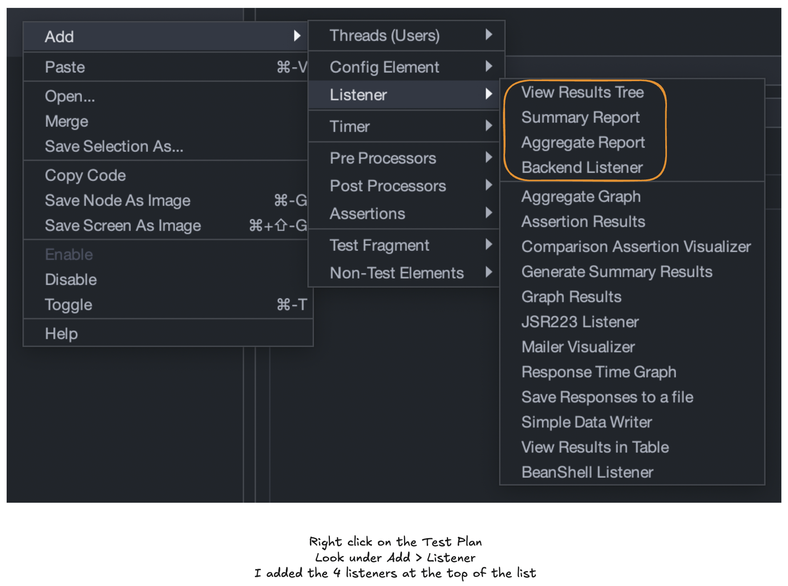

Next, I started working on specific options we wanted to use. Trial, error, and research ensued to determine how to accomplish our goals.

For example, we wanted to test real requests with randomized inputs using a CSV with thousands of possibilities. I found a [CSV Data Set Config](https://www.blazemeter.com/blog/jmeter-csv-dataset-config) option, but this inputs from the file line-by-line! Random inputs would better simulate a real-world test. Identifying that tool took more effort, but I did find it! We’ll cover that below.

### 🔁 option 1: http request

Testing an API service requires using an HTTP Request. Simple enough! Right?

Yes, generally. I added a name for the Request (optional) and the URL, path, and port number. This was pretty easy for local testing, but I learned that some changes are needed to access external services and resources via HTTPS requests!

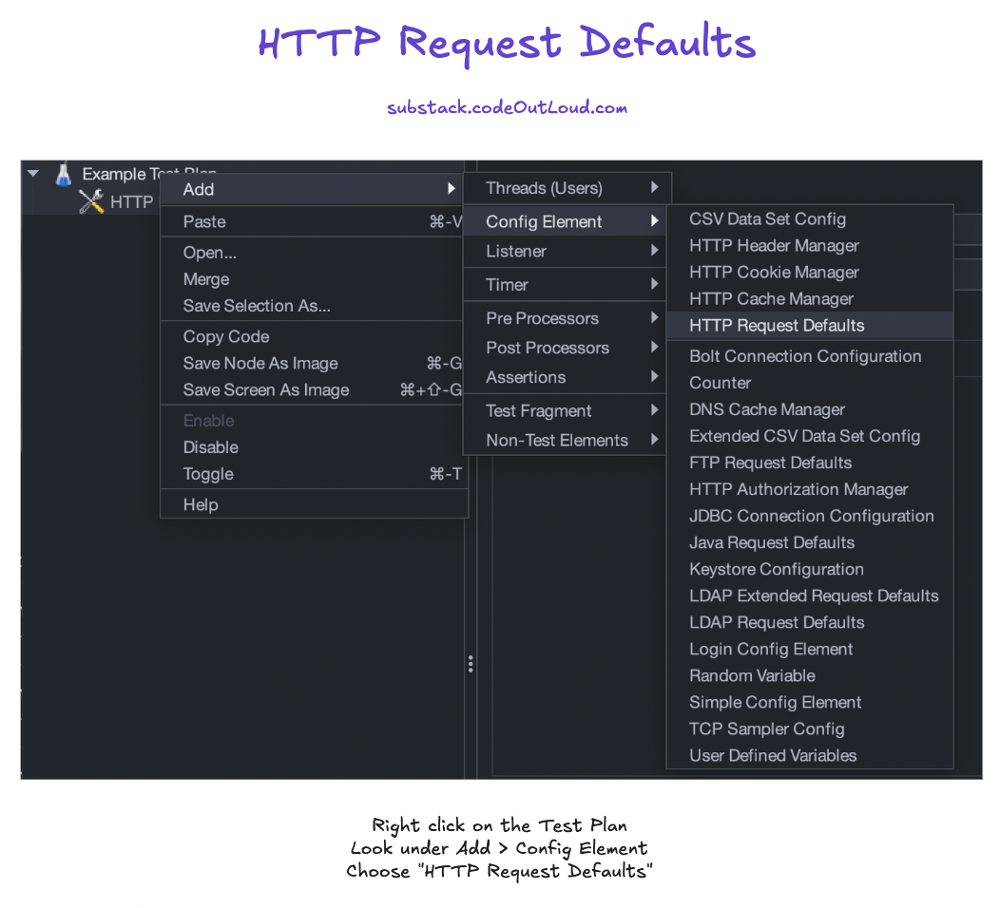

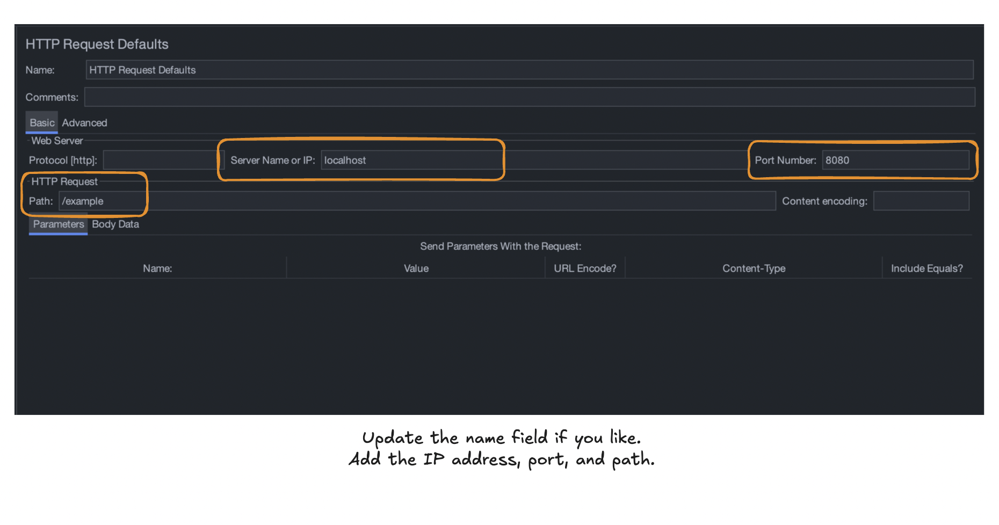

For an HTTPS request, identify the protocol in the protocol field and - likely - set the port number to `443` to access your SSL/TLS-secured resource.

Additionally, under the “Advanced” tab I needed to update the “Implementation” drop-down to the “HttpClient4” option. Later, I learned that having this option selected for HTTP request testing didn’t change anything, so I suggest this in all cases.

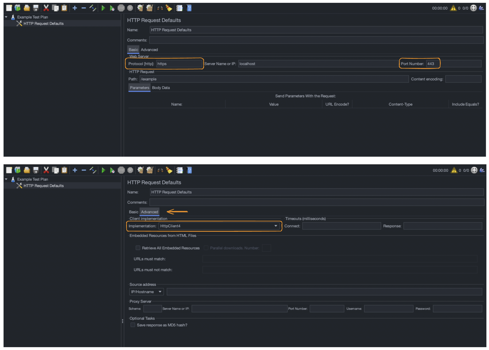

One “gotcha” you might encounter is that you’ll need to ensure you have a Thread Group first and then add associated options under that particular Thread Group. We’ll cover this below.

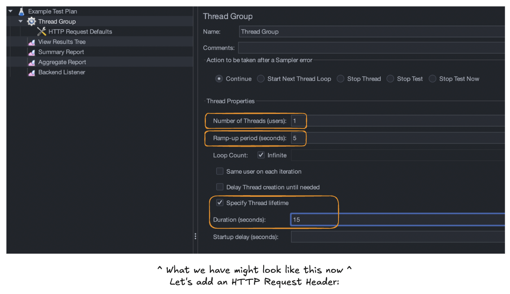

### 📋 option 2: http header manager

For our service, we use a specific header. This needed to be included for our service to work properly with the tests, and this was one of the simplest items to add. I popped in a header key and an appropriate value and checked this off the list. ✅

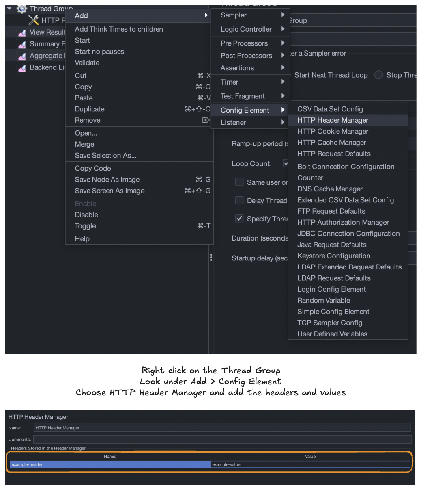

### ⏱️ option 3: constant throughput timer

While performing the initial simple tests to grasp JMeter, I discovered requests are sent without a throttle by default. However, we wanted to test specific loads that represented an approximate average of what we saw in the past for a similar service.

To achieve this, I used this option to provide a “Target throughput (in samples per minute).” Let’s examine that further. Say we were expecting 50,000 requests on average for the entire day for simplicity.

```
50,000 / 24 hours / 60 minutes = 34.7 requests/min (simplified, rounded)
```

In our example, I input 34.7 to the “Target throughput (in samples per minute)” field which would spread requests across the time frame provided to match this throughput. You can be more specific on the decimal, if desired.

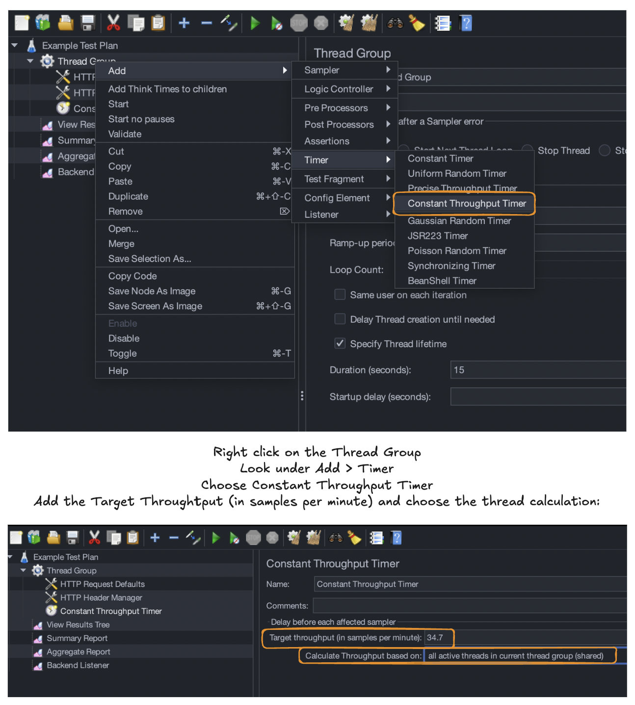

In other words, if I test for 1 minute, I should expect about 34 requests to have been sent and received for my test’s duration. This option was helpful for deeper control over our test parameters!

### 🧐 option 4: extended csv data set config

Finally, one of the most interesting options was the [Extended CSV Data Set Config](https://rollno748.medium.com/extended-csv-dataset-config-for-jmeter-17b1d8bda6b8). The CSV Data Set Config option didn’t provide the desired random input effect.

To use this, however, I needed to install the plugin. This was simple enough.

**Plugin Directions:** Access plugins by selecting “Options” in the Menu Bar, then choose “_**Plugins Manager**_.”

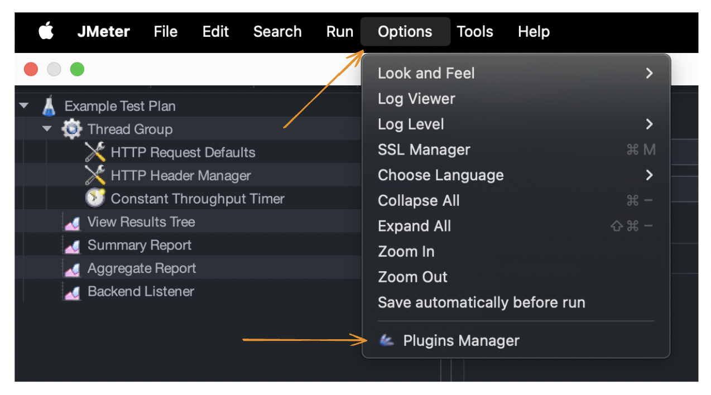

A window should open for the “_**Plugins Manager**_.” Select the “_**Available Plugins**_” tab and search for the plugin by name. Once identified, mark the checkbox and choose “_**Apply Changes and Restart JMeter**_” in the lower right corner.

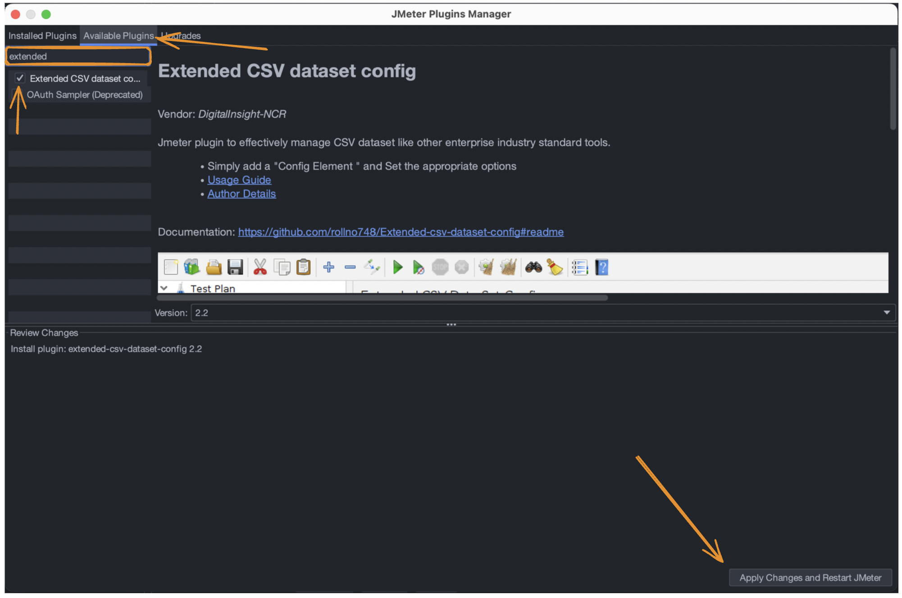

From here, I reviewed/updated the Filename, Variable Name(s), Consider first line as Variable Name, Select Row, and Sharing Mode fields.

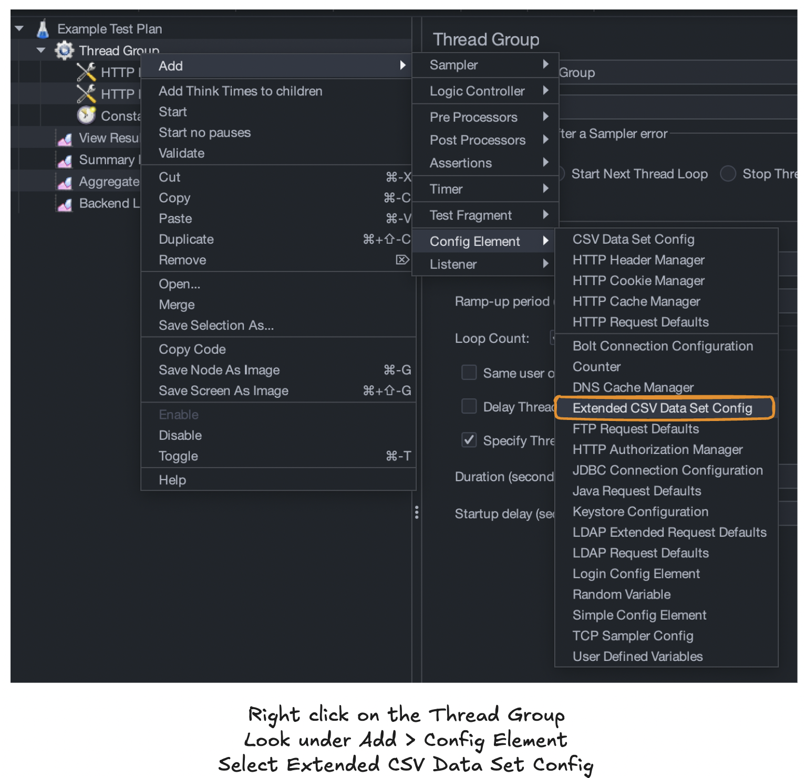

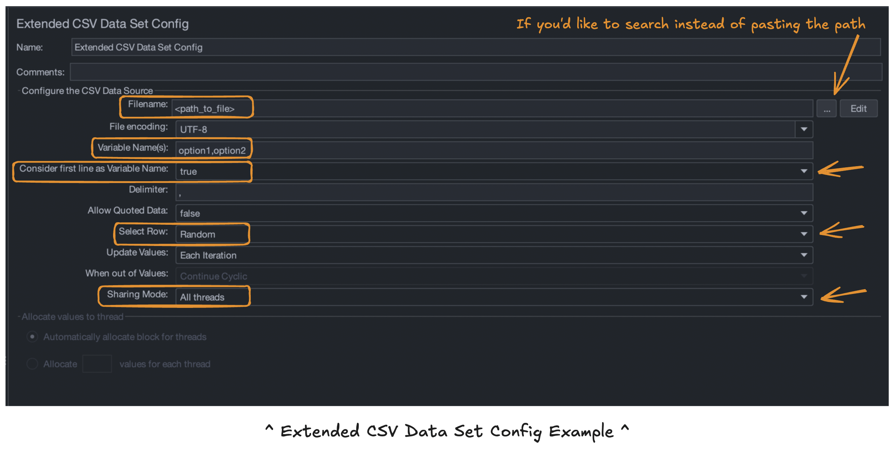

1. **Filename -** This was simple enough; I provided the path to my CSV file with the thousands of input options.
2. **Variable Name(s) -** In our case, our CSV had 2 labels in the header row that aligned with our request parameters. Let’s call them “option1” and “option2” for our example.
3. **Consider first line as Variable Name -** As mentioned, our CSV has a header row. Therefore, I left this set to true.
4. **Select Row -** [This resource](https://rollno748.medium.com/extended-csv-dataset-config-for-jmeter-17b1d8bda6b8#:~:text=using%20this%20plugin-,1.%20Select%20Row,-This%20selection%20allows) describes the options clearly. My goal was random and I chose this in the drop-down.
5. **Sharing Mode -** The options are “All threads,” “Current thread,” and “Current thread group.” I left the default “All threads” selected.

Now we’ve got a setup that replicates my selections!

> **👋 That’s it for now! I hope you’ll check out Part 2 where we cover the usage of JMeter followed by parameterizing the file to script and automate for future use!**

#### [jmeter performance testing: part 2](/blog/jmeter-performance-testing-part-2)

## further reading

- BlazeMeter: [JMeter Testing: Everything You Need to Know](https://www.blazemeter.com/resources/jmeter-testing)
  - PS I found many helpful resources on BlazeMeter!
- Radview: [What is JMeter?](https://www.radview.com/glossary/what-is-jmeter/#:~:text=Creates%20and%20sends%20requests%20to,XML%2C%20JSON%2C%20or%20text.)
- Medium: [Extended-CSV dataset config for JMeter](https://rollno748.medium.com/extended-csv-dataset-config-for-jmeter-17b1d8bda6b8#:~:text=using%20this%20plugin-,1.%20Select%20Row,-This%20selection%20allows)
