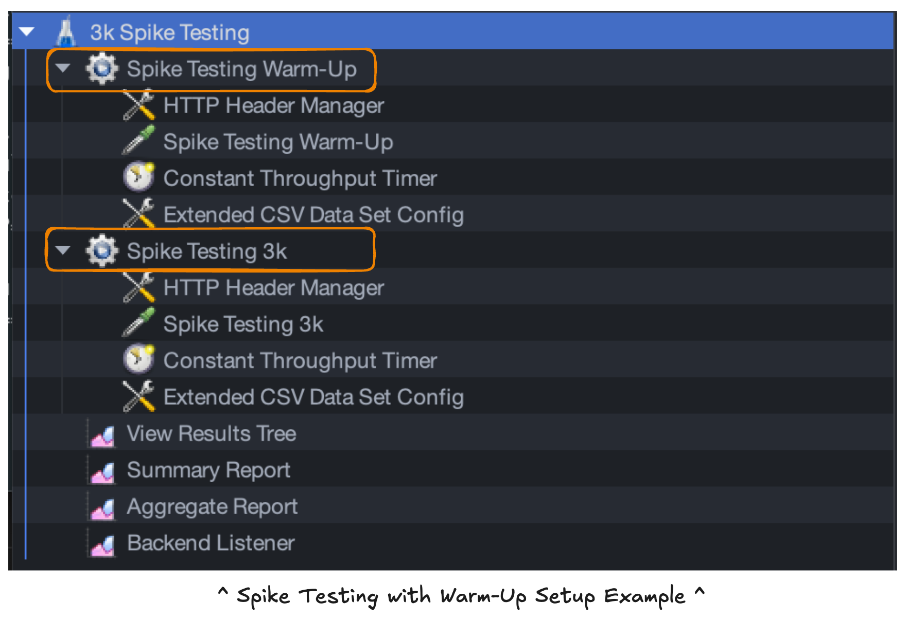
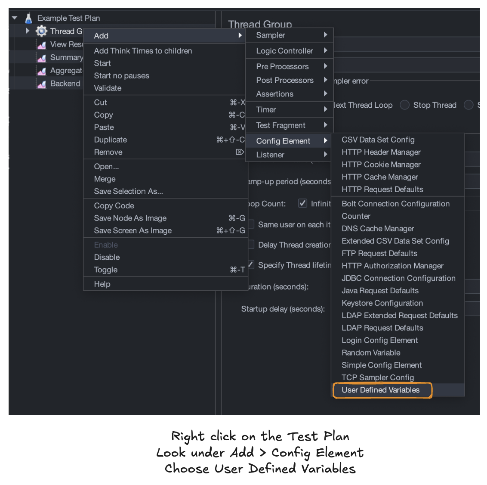
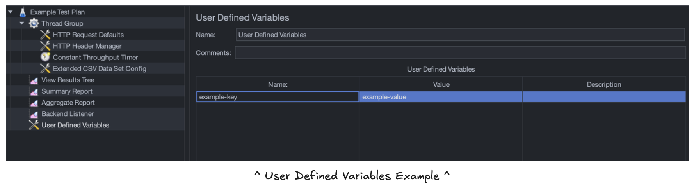
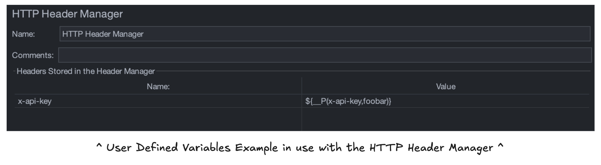
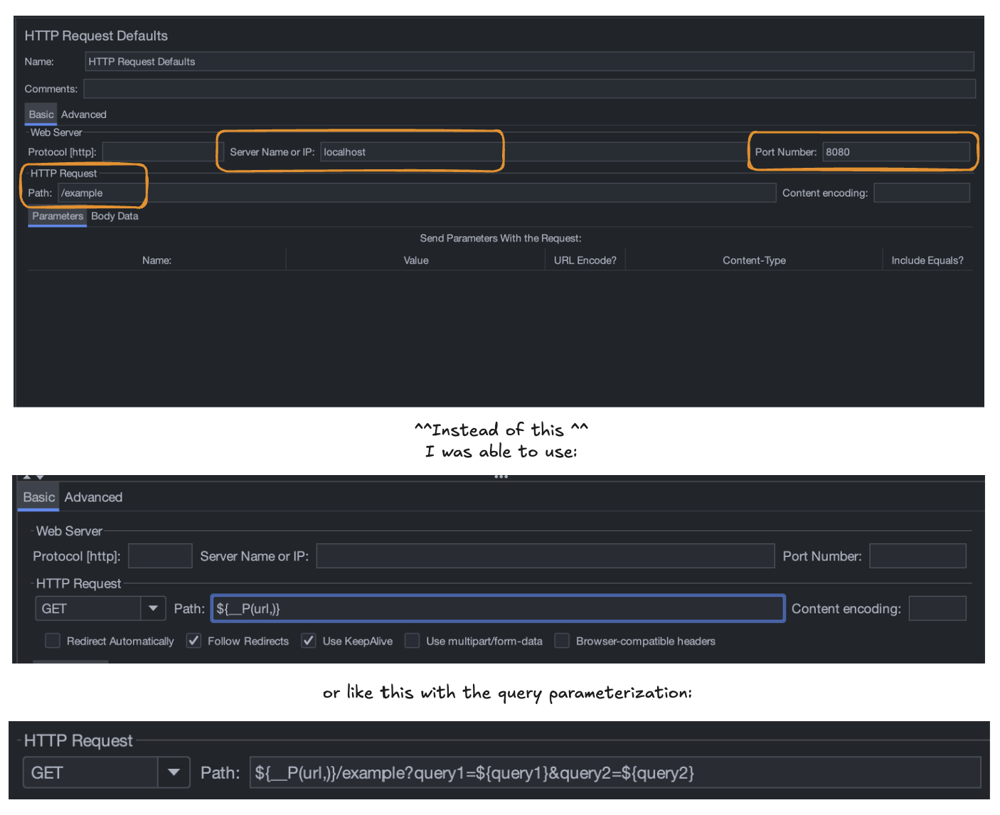

I previously shared the beginnings of my journey into JMeter in Part 1:

#### [jmeter performance testing: part 1](/blog/jmeter-performance-testing-part-1)

If you missed that, the TLDR is that JMeter has a nuanced interface that takes practice. We explored JMeter basics and discussed the setup options used for our specific API service that acts as a mapping translation.

Now, we move on to Part 2! ✌️This time, we’ll look at my usage and experience creating a script to parameterize and automate for the future.

**Here, we’ll cover:**

1. 👩🏽‍💻 Usage and Testing
2. 🤖 Script and Automate

## 👩🏽‍💻 usage and testing

To get going, I checked how JMeter worked in the GUI with a local server instance and also checked connections to our development service. It was important to me to check that everything worked properly before getting too far.

Then, we defined a plan for our performance testing. We had some example average data from a similar service. In [Part 1](/blog/jmeter-performance-testing-part-1), we used 50,000 daily requests as an average for simplified math. We’ll continue to use this for consistency. 👍

Before officially running the tests, _consider if others will use your service simultaneously_. In our case, other team members were implementing and pinging the service.

I informed others using the service with ample notice of the intended testing start and stop times. With a globally distributed team, the overlap was small. That said, it’s important to inform them so they don’t encounter unexpected issues and to avoid requests our tests aren’t capturing.

**Next, we’ll cover four key usage areas:**

1. Start with a Plan
2. Configure the Tests
3. Test Away
4. Don’t Forget to Document

_Let’s go!_

## start with a plan

We opted to perform **load testing**, **stress testing**, and **spike testing**. To learn more about these in detail, [check this Geeks for Geeks post](https://www.geeksforgeeks.org/performance-testing-software-testing/#types-of-performance-testing:~:text=users%20or%20transactions.-,Types%20of%20performance%20testing,-Performance%20Testing%20is). In the meantime, here are my generalized definitions:

**Load testing** checks the average load we expect to receive to ensure we can manage existing requests.

- We were also provided with the highest average daily requests for our project. For our example, let’s say that it’s 100,000 daily requests.

**Stress testing** pushes those average loads even further to see if we can find a maximum load.

- We opted to test 3x the load for simplicity to start. We discussed going further, but it seemed unrealistic that our load would increase more than this for now.
- \*Our service mainly exposed GET requests, so this high rate without failure is not unusual for simple read operations.

**Spike testing** adds a lot of stress quickly to see if the server can handle it.

- To ensure we weren’t hitting a “cold” server, we implemented a 5-minute “warm-up” period where we sent through the average load before attempting to push its limits.
- We also wanted to ask: If it fails, does it recover? How quickly will it recover?

**Standard Load testing** was recommended by one of our QA team members.

- This is essentially running the average load over 1-2 days to check the system’s long-term strength.
  - \*We decided not to, but we could have also tested the highest average load.
  - We chose 48 hours for our test.
- I opted to run this toward the end of the week and over a weekend to reduce disruptions for other devs testing out our service for implementation.

## configure the tests

Next, I used the setup options from [Part 1](/blog/jmeter-performance-testing-part-1). Although it was a bit cumbersome, I created a file for each testing scenario. I did this for two reasons.

1. I could work in a second JMeter instance to prepare the next test file while the current test runs without interruption. Using the same file and then saving a new version with the latest configurations saved a lot of time, ultimately.
2. I didn’t want to get my wires crossed with different configurations for each test scenario. With these pre-configured, I could revisit them when needed… Which came in handy when my internet became unstable during development testing.

_**“So, what were the configurations?”**_ you ask. Let’s cover some rough variations!

### 🔁 option 1: http request

For each test, this remained generally the same. The only difference was the local http:// request as opposed to the deployment service https:// request.

### 📋 option 2: http header manager

Another easy one! This remained constant between the sets of local and development service tests, but we used separate values for each environment.

### 🧐 option 4: extended csv data set config

Yes, I went out of order; bear with me! This was another consistent option. This setup used the same CSV file with thousands of inputs.

### ⏱️ option 3: constant throughput timer

Here’s where most of the complications came in. Each test had a different throughput amount and/or time range we wanted to test. Below are the details. Remember that the throughput field needs a number for the “samples per minute.”

Again we assume we had an average of 50,000 daily requests with the highest average of 100,000 daily requests for easier reference. I’ve rounded all results for simplification, but you can extend to whatever decimal point range you like.

#### **load testing**

- Average Load Testing
  - **Time:** We wanted to test the average load over an hour.
  - **Throughput:** 50,000 / 24 hours / 60 minutes = **34.7 requests/minute**
- Highest Average Load Testing
  - **Time:** We wanted to test the highest average load over an hour for consistency.
  - **Throughput:** 100,000 / 24 hours / 60 minutes = **69.4 requests/minute**

#### **stress testing**

- 3x the Average Load
  - **Time:** For consistency, we maintained an hour timeframe.
  - **Throughput:** Multiply the Average Load Test amount by 3. I’m using the rounded number to keep things simple.
    - 34.7 requests x 3 = **104.1 requests/minute**
- 3x the Highest Average Load
  - **Time:** For consistency, we maintained an hour timeframe.
  - **Throughput:** Multiply the Highest Average Load Test amount by 3. I’m using the rounded number again to keep things simple.
    - 69.4 requests x 3 = **208.2 requests/minute**

#### **spike testing**

We set up a short “warm-up” period for the server to better simulate a real-world spike among regular traffic in each spike test. Each of my warm-ups lasted 5 minutes and used the average load throughput of **34.7 requests/minute**.

It’s worth noting that adding a warm-up period requires an additional thread to set up different throughput and test details.



For consistency, each spike test was set to last for 10 minutes after the 5-minute warm-up. Below are three options I chose, though you may make different choices based on your expected traffic load or how hard you want to test the system.

- 3,000 requests
  - **Throughput:** To simulate this spike, we will divide our spike amount of 3,000 by the 10-minute timeframe.
    - 3,000 requests / 10 minutes = **300 requests/minute**
- 10,000 requests
  - **Throughput:** To simulate this spike, we will divide our spike amount of 10,000 by the 10-minute timeframe.
    - 10,000 requests / 10 minutes = **1,000 requests/minute**
- 50,000 requests
  - **Throughput:** To simulate this spike, we will divide our spike amount of 50,000 by the 10-minute timeframe.
    - 50,000 requests / 10 minutes = **5,000 requests/minute**

#### **standard load testing**

After performing all of these, I checked with our QA testing expert to see if I had missed anything. She suggested we perform this test, too! I repeated the average load and highest average load tests with a much longer timeframe.

- Standard Average Load Testing
  - **Time:** We wanted to test the standard average load over 2 days or 48 hours.
  - **Throughput:** 50,000 / 24 hours / 60 minutes = **34.7 requests/minute**
- Standard Highest Average Load Testing
  - **Time:** We wanted to test the standard highest average load over 2 days or 48 hours.
  - **Throughput:** 100,000 / 24 hours / 60 minutes = **69.4 requests/minute**

This is quite a long time to test! In our case, we had others using the API to implement it in the platform to ultimately use the service. For this reason, I tested Friday through Sunday. I checked in a little over the weekend, which is easy to do when you work remotely. 👍

## test away

Once everything is set up, run the tests!

I kept an eye on them and did low-key tasks while waiting to check the progress in case of any issues. For instance, my internet cut out during one of my tests! I quickly reset and started the test again.

## don’t forget to document

Immediately after finishing the tests, I documented results, stored the test files, and gathered details so anyone could access and run the tests later if desired. Don’t wait!

I added this to a Confluence document with additional information, like which plugin(s) would be needed.

Documentation like this, even if it’s not exciting, will be helpful for your team and your leaders to know what you tested so they can provide feedback and understand what was tested if more testing is needed later.

## 🤖 script and automate

Despite all that lovely documentation, my teammate and I felt storing test files in the repo would be best for our future selves and teammates.

What would be even better? If our future selves and teammates could run those tests with a simple script, all the better! Let’s talk about implementing automated testing capabilities using parameters.

_This is where the real fun began!_

## user defined variables

The first thing to learn was how to use the [CLI](<https://jmeter.apache.org/usermanual/get-started.html#non_gui:~:text=1.4.4%20CLI%20Mode%20(Command%20Line%20mode%20was%20called%20NON%20GUI%20mode)%C2%B6>) and incorporate User Defined Variables. This [Stack Overflow response](https://stackoverflow.com/questions/59139762/how-to-use-command-line-parameters-in-jmeter#:~:text=10-,Let%27s%20start%20clean%3A,-In%20the%20User) helped get me started.

Again, I toyed with different options and worked through some examples to get comfortable with User Defined Variables. It’s neat to see just how much you can parameterize! _Spoiler alert: almost everything!_

### how to parameterize?

First, we need to add a config element for User Defined Variables.



Then, we can add in our key-value pairs. Here’s an example using a key of example-key and a value of example-value.



Then, these variables can be plugged into various fields throughout the test! Let’s look at a simple example. We will use the following snippet to introduce our User Defined Variables as a parameterized value:

```js
${__P(example-variable,default)}
```

The left side within the parentheses is our User Defined Variable name (x-api-key below), and the right is our default value. In the case below, we use foobar. Meaning, if we provide no value, foobar will be used as the value for this header.



One important thing I learned during this process is that it is possible to use the full URL in the path instead of setting the protocol, the server name/IP address, and identifying the “Advanced Implementation” setting [described here in Part 1](/blog/jmeter-performance-testing-part-1).



## consider the options

Once I had thoroughly tested the available parameterization options, I had to consider our goals. I first went overboard and made a single test file that we could run any test we wanted because everything was parameterized, with most of the test numbers defaulting to zero as a safe placeholder.

We discussed this and decided on the best options to parameterize, limiting our files to 3 in total instead of one for every single test scenario. **Here’s a sample of the script:**

```bash
jmeter -n -t <path_to_file.jmx> \
  -Jurl=<url> \
  -Jx-api-key=<optional-api-key> \
  -Jcsv=<path_to_input_file.csv> \
  -f -l <path_to_results_file.jtl>
```

**What's happening here?**

**-n** - This argument tells JMeter to run in CLI mode

**-t** - This indicates that the next argument provides a path for the .jmx test file

**-Jkey=value** - The **url**, **x-api-key**, and **csv** keys were defined within the test plan to accept user input

- I made the **url** value required! The protocol is necessary to include.
  - For example, use http://127.0.0.1:8080 for local testing or https://url-path.com for external testing.
  - I added specific instructions not to include the path and queries for the URL, as I configured this for randomized testing in the JMeter test plan.
- **x-api-key** was optional. The default value was foobar as mentioned above.
- **csv** accepts a file with options we discussed in [Part 1](/blog/jmeter-performance-testing-part-1).

**-f** - This argument tells JMeter to force delete existing results files and web report folder if present before starting the test as a cleanup step

**-l** - This indicates that the next argument provides a path to store the test results in either a .jtl or .csv file

Once a test is completed, you can review the results! Using .csv is an option, but it provides minimal detail. The most informative option uses JMeter GUI mode to review the .jtl results file using the View Results Tree, Summary Report, or Aggregate Report options within the test plan.

## create and iterate

I started by creating the three files.

#### load test

I created a load.jmx file, which contained the default settings for a 60-minute test of the average load.

#### stress test

The stress.jmx file contained the default settings for a 60-minute test of 3x the average load.

#### spike test

The spike.jmx file contained the default settings for a 10-minute stress test (50k spike target by default). As with spike testing, there is a 5-minute warm-up before the spike start for a 15-minute total test.

Then, I tested the files thoroughly with all input options I had parameterized to confirm they worked as expected!

Finally, I added these files to the repo and added information on a sample script and how to use it, similar to what I shared above.

**I hope that this has been helpful and/or interesting! This was where the fun presented itself in the form of a challenge; it was a joy trying to figure out the parameterization!**

## 📚 further reading

- Stack Overflow: [How to Use Command Line Parameters in JMeter](https://stackoverflow.com/questions/59139762/how-to-use-command-line-parameters-in-jmeter)
- Perforce: [BlazeMeter - User Defined Variables](https://portal.perforce.com/s/article/Using-User-Defined-Variables-1707509382889)
- BlazeMeter has so much more to learn. A reader [suggested this free course](https://university.blazemeter.com/learn/course/external/view/elearning/485/apache-jmeter-intro) to guide you from introduction through running the test and analyzing the results.
- It's possible to get free completion certification at the end!
