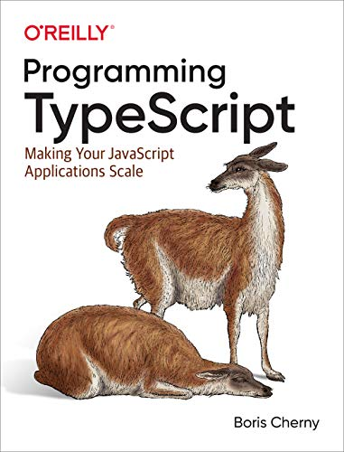
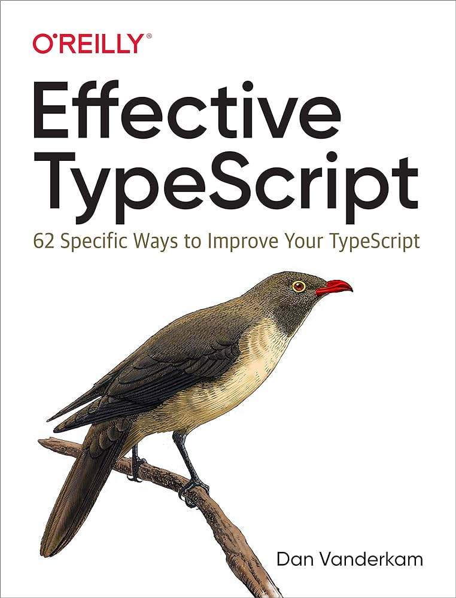
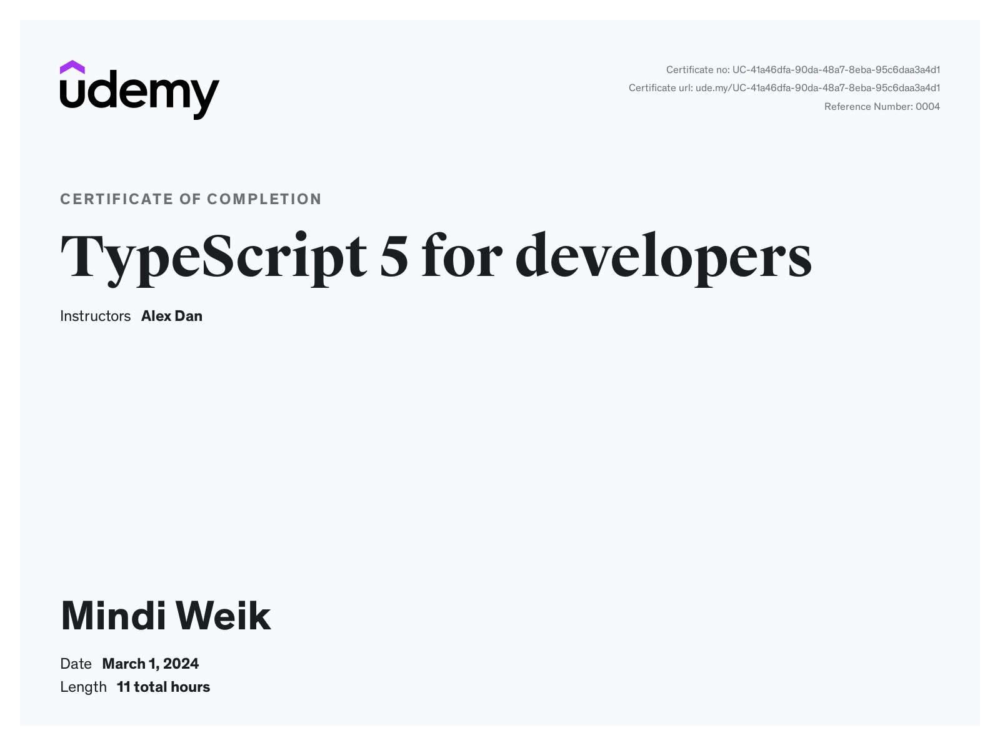

My initial developer training consisted of mainly JavaScript. When I began a role using TypeScript, I wanted to learn best practices and how to work well as quickly as possible. 

That said, true learning takes time. I have to remember to be patient and that practice makes me better each time I do it! I’m about a year in and I wanted to share what’s helped me the most during this time.

The base knowledge of JavaScript helped a lot with learning TypeScript as it’s a superset of JavaScript. It’s open-source and written/maintained by Microsoft. It’s pretty powerful in my experience.

However, there are a lot of nuances and unexpected cases within TypeScript I found interesting along the way. 

We'll talk through my core learning materials and suggestions:

1. 👩‍💻 Scrimba
2. 📖 Programming TypeScript by Boris Cherny
3. 🤓 Effective TypeScript by Dan Vanderkam
4. 💻 Udemy: TypeScript 5 for Developers by Alex Dan
5. 💪 Lots of Practice

## 👩‍💻 Scrimba

When I first started, I sought an interactive way to learn, which is how many best absorb knowledge. I found this in Scrimba!

[Scrimba](https://scrimba.com/allcourses) is a really cool platform for learning. Watch a video while also toying with the examples directly in the embedded code editor! It’s a new and engaging way to go through coding tutorials while also getting your hands dirty, so to speak.

I found a course here called “[Learn TypeScript](https://scrimba.com/learn/typescript)” by [Ania Kubow](https://www.linkedin.com/in/ania-kubow/?originalSubdomain=uk). I’ve followed some of her [YouTube tutorials and courses](https://www.youtube.com/@AniaKubow) before, so she was a welcome and familiar face for me!

I’ve taken a look at other Scrimba courses since taking this particular course and I’ve enjoyed a majority of those I’ve worked on or experienced.

## 📖 Programming TypeScript by Boris Cherny

A teammate sent this book to me and I was so grateful. There are so many beginner-friendly concepts here that were helpful. 

Even though I had been working with TypeScript for a couple of months when I received the book, these concepts were essential to solidifying my foundation. Even the seemingly simple details that are core to the functionality have deeper descriptions embedded and some helpful use cases to build better understanding.

As the book moves forward, more advanced concepts and examples are provided, too, so regardless of level of experience with TypeScript there is sure to be something for everyone to take away!

## 🤓 Effective TypeScript by Dan Vanderkam

I felt this book had more tangible and actionable advice, tips, and examples. *Programming TypeScript* felt better at providing that aforementioned foundation and underlying concepts.

This book was also broken into 62 very specific ways to get better at TypeScript, making it very easy to pick up, read one “item,” and then put it down to practice it.

I’ve also [mentioned on LinkedIn](https://www.linkedin.com/posts/mindiweik_todoist-a-to-do-list-to-organize-your-work-activity-7179515177124462594-jaF3?utm_source=share&utm_medium=member_desktop) that I use [ToDoist](https://todoist.com/). Once I figured out the groove and commitment, I was able to put in a (mostly) daily task to complete an “item” each day. This helped keep motivation to move toward completion when it was in such digestible chunks!

I’ll refer back to this book, in particular, to take a look at it’s very specific examples and suggestions when I run into any issues or need inspiration to solve a problem.

## 💻 Udemy: TypeScript 5 for Developers by Alex Dan

Generally, I appreciate repetition in my learning. 

I found [TypeScript 5 for Developers](https://www.udemy.com/course/typescript-full-stack-programming/?couponCode=ST8MT40924) on [Udemy](https://www.udemy.com/) by [Alex Dan](https://www.linkedin.com/in/alex-dan-02598a137?miniProfileUrn=urn%3Ali%3Afs_miniProfile%3AACoAACFtJ50B6aaQ7qIcbN88GJz13jVmTL9AQRY&lipi=urn%3Ali%3Apage%3Ad_flagship3_search_srp_all%3Bs89i5unCQlia%2F4aPZ4hsEA%3D%3D). I took this course over the same time I was reading *Programming TypeScript* and *Effective TypeScript* and it happened to time out well to reinforce my learnings!

I would read about a concept and then within some short time, I would come across a similar concept in the course…or sometimes the other way around.

In this way, I was hitting all the bases for learning: repetition of concepts, read it statically, watch it “live” in a code editor, hear about it from a knowledgeable source, and practice the concepts in my daily work through small, local code edit tests. 

I haven’t done a review of this course, like I did with the [Fundamentals of Backend Engineering](/blog/fundamentals-of-backend-engineering-course-review) course, but I would give it a similar review. The value was high (I also actually bought the TypeScript course in the same sale), the content was manageable and informative, and I learned a lot!

## 💪 Lots of Practice

This should not be understated! Practice makes perfect and there is a reason why the cliche exists. If anything, this was the ***most*** helpful aspect of my learning journey and I encourage everyone to take this seriously in their own journey.

When I first started using TypeScript at work, I spent time reading the [official documentation](https://www.typescriptlang.org/docs/handbook/intro.html) if I wondered how something in the codebase worked. I paired with a teammate to ask questions and used the [playground tool](https://www.typescriptlang.org/play) to test how things worked.

As I moved along, I wanted to see how TypeScript worked on the frontend, too. So, I created a fun, small project I called [pretty kitties](https://github.com/mindiweik/prettykitties) using a [free cat API](https://thecatapi.com/)! I’m glad I did this because there are some really interesting nuances using React with TypeScript! I found a really helpful article on using the two together when I worked on this project, but I haven’t found it again to share. (If I do I sure will!)

Having an active codebase to contribute to offered plenty of practice! Code reviews were essential in helping me formulate a better understanding and provided different ideas on how to approach the styling and usage of the tools.

That said, I also wanted more practice outside of work. I picked up a side project with some friends, a team of 4 developers including me, and we’ve been working on codebases involving a backend API and frontend for a project I hope to share more about soon! 

Working on another team showed me even greater variation of styles and practices and I’ve learned *so* much more working on this side project and practicing my skills than if I had simply stuck to my work alone.

I’ve been keeping my eye out for more opportunities to work on other projects. One open source project has caught my attention, but I also need to figure out a good balance for myself to be able to contribute to more while also working, contributing to the side project, having a life, and writing this lovely, informative blog!

**I’ll get there soon enough!** 🤩
