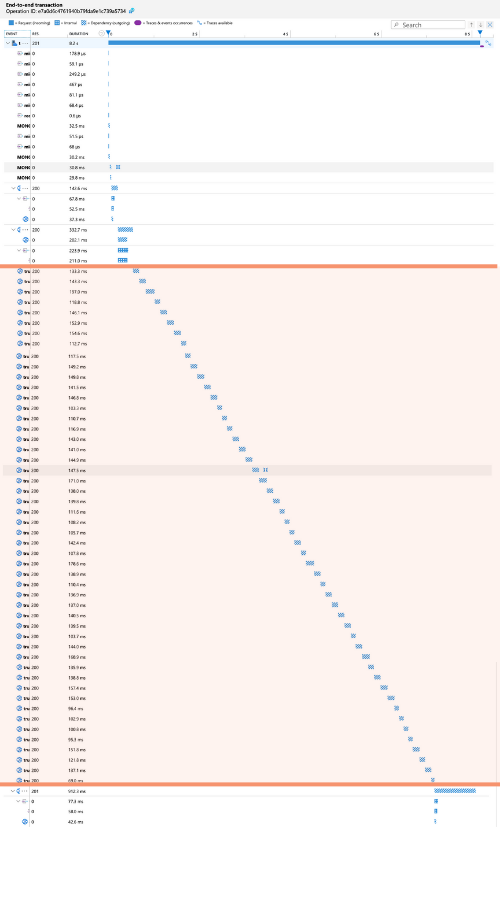
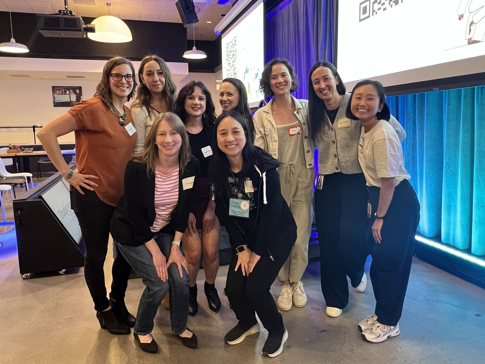

If you don’t like new, shiny things…then I’m not sure you’re human.

Just kidding! Often we are enamored with shiny object syndrome in tech and as someone who has had the luxury of working on mostly greenfield projects, it’s usually for good reason.

It’s fresh, it’s clean, we can do what we want! To some extent, yes, but it’s hard to know how much you need something until you don’t have it because you didn’t set it up yet.

In my case, I didn’t know just how much we needed [Open Telemetry](https://opentelemetry.io/)! Let’s take a high-level look at what this is and how it can help in most projects.

_\*There are **oversimplifications** here to share foundational concepts at a high level._

**Here, we’ll cover:**

1. 👾 What is Telemetry?
   1. 🤓 Real Example
2. 📊 What is Observability?
3. 🔭 What is Open Telemetry?

_Blasting off!_ 🚀

First, I want to share a bit of a story with a fun analogy I enjoyed using in my recent **Denver Gusto Lightning Talks from Women and Folks in Tech** lightning talk!

Here I have also gone into more detail than I was able to cover in my 5-minute lightning talk. _Talk recording at the end of this post for those interested!_

## have you ever tried debugging without logs?

When I started working on one of my first greenfield projects, we were still setting up our CI/CD pipelines for deployments and this was often my task.

We were logging within the application, to be fair. But, when our Kubernetes pods would restart those logs were lost! …More than once! It was frustrating to try to track down issues that popped up in the meantime. We looked into a few solutions, but didn’t find a good one we wanted to fully implement right away.

> "Debugging without logs is like being a detective at a crime scene where someone cleaned up all the evidence. 🕵️‍♂️ I was still trying to piece together what happened, but without fingerprints, witnesses, or a murder weapon.

**What could I do in the meantime?**

- Interview unreliable sources (like logs from our platform that calls our API service).
- Reconstruct the scene from scraps (like revisiting our code behavior).
- Rely on gut instincts and wild guesses.

It’s not impossible to solve bugs this way. However, it's frustrating, time-consuming, and prone to false leads.

_That’s where observability and telemetry come in! Let’s start small and build our way up, shall we?_

## 👾 what is telemetry?

I like to think of telemetry most simply as a _collection of data_.

But it’s more than just collecting data, especially in the context of OpenTelemetry. Telemetry refers to automatic gathering and sending of data from different parts of your system so you can see how everything is working and catch problems early.

This data is also what will be fed into our Observability tooling!

**There are 3 main aspects that make up telemetry data:**

- Logs
- Metrics
- Traces

### logs

Logs are text records of events that happen within your application. It’s an append-only data structure, usually including a timestamp and a message about the event.

In my case, we often use key-value pairs in JSON format which is called, “structured logging.” However, there are many opinions out there, as with most software-related practices, so there is no one perfect way to log events.

For instance, one API service I work with connects to a third-party vendor. Anytime we interact with a vendor resource (create, update, delete) we log that information.

_What resource was it, which customer does it belong to, what action did we take?_

Even some of the most mundane information can be surprisingly helpful when tracking down issues!

When something goes wrong, which can - and does - happen, it’s important to log the errors, too.

In the case of telemetry, logs are sent to a database with efficient storage that allows for filtering and searching.

### metrics

Metrics are numbers that help us track performance. It’s hard to measure something without numbers!

To best use metrics, it’s very helpful to have an idea of what measurements you want to track or a baseline of performance. This way you can tell whether or not your application is performing well.

There are 4 common types: counters, gauges, histograms, and summaries. I like to think of this as data that we can use to visualize what’s going on inside the application.

### traces

Consider these maps of what happened. You can follow the route to see what turns were taken and when.

This has, by far, been one of my favorite parts of exploring and working with the data received from [Open Telemetry](https://opentelemetry.io/)!

Not only can we see every _single_ step of the API request, but we can also see how long each step took and whether we connected to or called internal or external services. There’s so much we can see even beyond that, too!

Because we can now see previously invisible bottlenecks, we can identify what to change to improve performance. Another way to think of this is like security cameras for our app. We can rewind what happened and catch invisible issues in the act!

_**Let’s look at a recent example I encountered!**_

## 🤓 real example

While reviewing some of the data, we noticed in our **metrics** that there were several of requests that were taking give or take an average of ~8 seconds to respond.

That’s _WAY_ too long for what should be a fairly simple request that also didn’t take nearly that long when we developed it! 🤯

I was tasked with figuring out what was going on. I reviewed our **logs** and **traces** for offending events to track down the issue. Essentially, we had multiple similar calls to a vendor that didn’t appear to be necessary and slowed these responses _WAY_ down.

Blurry for added privacy and to capture all trace events. Highlighted portion = all the same call repeated multiple times

### _**what was happening?**_

Upon first glance, it appeared related to a code call that shouldn’t have been happening with the inputs provided. I was questioning, “how in the world is this getting called with an expected undefined input?” 🤔

I spent more time working with it and drilled deeply into our [Azure Application Insights](https://learn.microsoft.com/en-us/azure/azure-monitor/visualize/insights-overview). Long story short, we were unwittingly making repetitive function calls when initiating an interface that _should_ have only happened once. 😱

We didn’t notice it because our local data set is MUCH smaller than our production data. As one might expect. So, we were making this call, but it was no big deal, it was fast. At production scale, however, it was taking far too long.

**Yikes!**

After a relatively simple refactor of how this interface was initiated and this particular value captured (and now stored) at the very beginning, I tested with Application Insights again locally and I was thrilled to find out that I fixed it! 😮‍💨

## 📊 what is observability?

As simply as possible, I would define observability as a collection of data. Specifically all of the telemetry data we already covered!

Of course, it’s more than just that.

In more complex terms, it’s a way that we can get a snapshot of the state of our system to understand the workload, the structure of our system including external services or load balancers or the like, and our resources in use.

Myriad tools exist for observability, some with more emphasis on certain telemetry data than others. Though not an exhaustive list, some examples include:

- Jaeger
- Prometheus
- Garfana
- New Relic
- Datadog
- Dynatrace
- Splunk
- Sentry
- **Cloud-native infrastructure monitoring:**
  - AWS CloudWatch – Native observability for AWS infrastructure.
  - Azure Monitor / Application Insights – Observability for Azure services and apps.
  - Google Cloud Operations Suite (formerly Stackdriver) – GCP's native observability tools.
- …and there are more that exist!

The point is, there are a lot of options. To decide, you will also need to know what information is most important to your company, for your software, or whatever other stakeholder so you can capture and display that data most appropriately.

## 🔭 what is open telemetry?

Again, in the simplest terms: OTel is a free, open source framework. It aids in the collection and export of telemetry data to various observability tools.

It’s especially handy because it works with a wide variety of coding languages to ultimately _**standardize**_ your observability data from your applications. The biggest benefit is that you’re not locked into one tool or vendor! I believe that this is causing it to quickly become the industry standard for telemetry and observability.

Before [Open Telemetry](https://opentelemetry.io/), observability tools didn’t have standards. Every tool had a unique implementation, which made it hard to shift when it was needed or desired. This also meant that there was a fairly high barrier to entry - to use it in your application - because observability was complicated to implement if you had to know different processes for each service.

What if we wanted to add multiple services? _**Lookout, messy and complex code additions!**_

After we implemented Open Telemetry into our API services I was working with, we could now see what was previously invisible! 🫥

Open Telemetry does a great job of tying together all of the telemetry data so it can be exported to an observability tool. This is where we can make sense of it!

In my lightning talk I shared an oversimplified flow.

  
Open Telemetry flow

  

    

      
01 · instrumentation

      
Code or libraries to collect data

    

    
→

    

      
02 · sdk

      
Gather and organize the data

    

    
→

    

      
03 · exporter

      
Send the data to your observability tool(s)

    

  

  
Oversimplified Open Telemetry flow as shown in the presentation

Essentially:

- **Instrumentation -** We begin by adding the code or libraries into our application.
  - In my case, this is initiated before the server starts up so that we can capture information about the pods or failed startup, if needed.
- **Software Development Kit -** The code/libraries then help to collect and organize the data, preparing it for send-off.
- **Exporter -** At the end, we send that data to our observability tool via Open Telemetry!
  - It feels a little like magic when you see your data appearing in your tool. Very satisfying!

There are opportunities for customization, but better yet, there are “auto-instrumentation” libraries that exist for most languages to make setup a breeze. We used auto-instrumentations-node in my project and it was well worth the usage for a team just starting to work with OTel! ([npm package link](https://www.npmjs.com/package/@opentelemetry/auto-instrumentations-node))

Once it’s implemented, Open Telemetry is useful for debugging, maintaining reliable systems, and monitoring performance of your application(s).

## closing thoughts

[Open Telemetry](https://opentelemetry.io/) isn’t necessarily super _easy_ to use, but it was much easier to work with than I expected!

Speakers and Organizers from the Denver Gusto Lightning Talks with Women and Folks in Tech on April 22, 2025 | Left to Right: Mindi Weik, Kseniya Lifanova, Margaret Sabelhaus, Lisa Barcelo, Tori Huang, Alejandra Dominguez, Christine Lee | Second Row: Liz Donovan, Vui Nguyen

It takes some “fiddling” to get it to work properly for your setup and we’ve poured over the data we have since received to begin to understand what we’re capturing and what it means.

There is also a bit of a learning curve getting to know your observability tool(s) of choice.

But, all-in-all, it has been well worth the time investment. Our application is now more resilient and reliable. Just look back at that real world example above! ⬆️

I am still amazed at how helpful OTel has been in identifying not only issues we didn’t know existed, but also digging into the logs and traces in one place so we could follow the steps and pinpoint the root cause.

It feels like our real example was resolved much faster than it would have been had I went through many other steps to debug and figure out the nuanced issue that didn’t appear like an issue locally!

If you haven’t yet, but you want to improve your understanding of your application adn its actions, I highly recommend Open Telemetry! 😁

## 👀 bonus: recording

  <iframe src="https://www.youtube-nocookie.com/embed/s3JYirx26s8" title="How to See the Invisible: Intro to OpenTelemetry" loading="lazy" allow="accelerometer; autoplay; clipboard-write; encrypted-media; gyroscope; picture-in-picture; web-share" allowfullscreen style="position:absolute;inset:0;width:100%;height:100%;border:0"></iframe>

